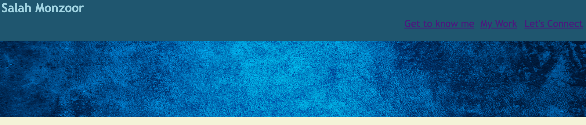
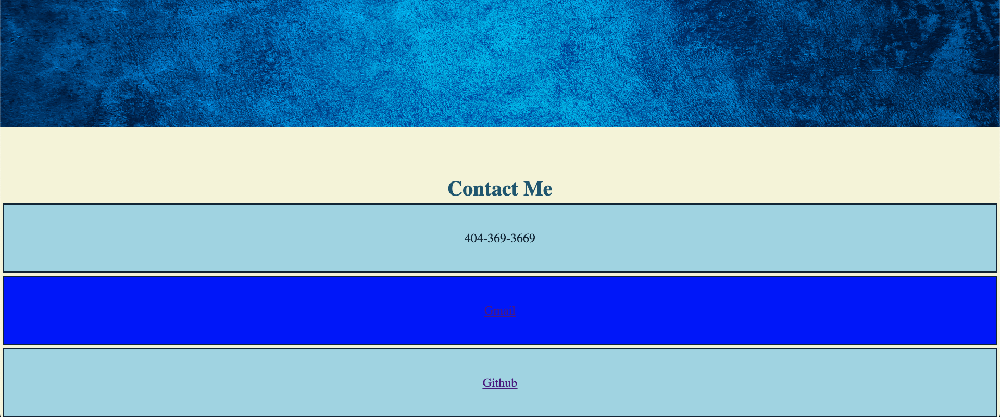

Professional Portfolio
## Description

This assignment was to showcase how to start from scratch,implement HTML and CSS in our code, how to make our repository, how to clone your repository to your computer from Github, how to commit and push your code, how to publish your website, and how to implement divs, headers, style, colors, padding, margins, etc. The purpose of this assignment is to showcase these skills and build a professional portfolio about myself showcasing projects (at the moment there is nothing but will be updated) and also how to contact me for potiental future employment opportunnites! 

## Usage
Implemented in HTML Headers, Selections, Ul, Li, href for links, body, linking the CSS Style sheet together so the CSS code works with the HTML.
In CSS used root to make sure the color properties were universal and not repeated in the code, refrenced classes, id, used flexbox concepts,refrencing img files to cater them to fit in a section, used the hover feature to make sure a cursor can be used when "hovering" over the items or boxes, used active and focus to make sure the box shadows worked with the hove, and implemented border, padding, text-align, font size, etc.

Website URL!!

https://salzm.github.io/Professional-Portfolio/